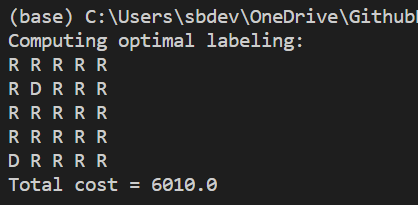

# Part 2: Understanding Markov Random Fields

# Objective

-   In this part we are expected to implement a min-sum loopy belief propagation for the problem of town planning by assigning the houses an affliliation of "R" or "D"
-   Each house may have some innate predilection towards a particular affiliation described by the bribe matrices.
-   If any two adjacent houses have a difference in affiliation a fence needs to be constructed resulting in a cost of 1000 per side of fence.
-   The city council's aim is to come up with a configuration with minimum cost overall for implementation

# Methodology

Main Reference: <http://nghiaho.com/?page_id=1366>

-   I have tried to implement the min sum loopy belief for the problem by using a  modular approach to the question the closely resembles the orignal mathematical expression

## DataCost (Unary function)

-    The data cost is the cost of a node to assume a given affiliation given ny either of the bribe matrices.

```sh
def DataCost(I_node_coord, i_Label, TotalBribes):
    label = {"R":0,"D":1}
    return TotalBribes[label[i_Label]][I_node_coord[0], I_node_coord[1]]
```

## FenceCost (Pairwise function)

-   A straight forward function that checks if adjacent nodes are same affiliation or not and assigns a corresponding cost.

```sh

def FenceCost(I_label, J_label):
    return 0 if I_label == J_label else 1000

```
## Label map evaluation

-    The following function calculates the arrangement cost of a given label matrix

```sh

def _CurLabelMapCost(CurLabel):
    cost = 0
    for i in range(n):
        for j in range(n):
            if i < n-1 and CurLabel[i][j] != CurLabel[i+1][j]:
                cost += 1000
            if j < n-1 and CurLabel[i][j] != CurLabel[i][j+1]:
                cost += 1000
            if CurLabel[i][j] == 'R':
                cost += TotalBribes[0][i][j]
            else:
                cost += TotalBribes[1][i][j]
    return cost

```

## Message Propagation

-   The core loop has various sub parts that need to be addressed in sequence.

### main loop

```sh
def MessagePropItr(n,TotalBribes,NGraph,Message_store):

    Message_working = InitWorkingMessageMatrix(n)
    for x_coord in range(n):
        for y_coord in range(n):
            i_node = (x_coord,y_coord)
            for j_direction in ["RIGHT","LEFT","DOWN","UP"]:

                if j_direction == "RIGHT" and ((i_node[1]+1)<=n-1):
                    j_node = (i_node[0],i_node[1]+1)
                    Message_working[j_node][1] = _CalculateMessage(i_node,j_node,TotalBribes,NGraph,Message_store)
                    #print(f"{i_node} --> {j_node} to Message_working[{j_node}][direction[LEFT 1]]")
                    
                elif j_direction == "LEFT" and ((i_node[1]-1)>=0):
                    j_node = (i_node[0],i_node[1]-1)
                    Message_working[j_node][0] = _CalculateMessage(i_node,j_node,TotalBribes,NGraph,Message_store)
                    #print(f"{i_node} --> {j_node} to Message_working[{j_node}][direction[RIGHT 0]]")

                elif j_direction == "DOWN" and ((i_node[0]+1)<=n-1):
                    j_node = (i_node[0]+1,i_node[1])
                    Message_working[j_node][3] = _CalculateMessage(i_node,j_node,TotalBribes,NGraph,Message_store)
                    #print(f"{i_node} --> {j_node} to Message_working[{j_node}][direction[UP 3]]")

                elif j_direction == "UP" and ((i_node[0]-1)>=0):
                    j_node = (i_node[0]-1,i_node[1])
                    Message_working[j_node][2] = _CalculateMessage(i_node,j_node,TotalBribes,NGraph,Message_store)
                    #print(f"{i_node} --> {j_node} to Message_working[{j_node}][direction[DOWN 2]]")
                
    if np.max(Message_working) >=  1000000:
        Message_working -= np.min(Message_working)

    return Message_working
```
-   As can be seen above we have a nested triple for loop for i_x,i_y coordinate and the direction of message being sent which decides the j nod eand uses the function _CalculateMessage to calculate the value of the message that needs to be sent to the jth node and stores the resultant message value in a message matrix of the following format in the jth node.

-   The normalization is affecting the capabillity of the BP to converge hence limiting the iterations to 90 before overflow. and even beyond 90 there is no tendency to convergence.

```sh
[[
[["R_val","D_val"][,][,][,]],[[,][,][,][,]],[[,][,][,][,]],[[,][,][,][,]],[[,][,][,][,]],
[[,][,][,][,]],[[,][,][,][,]],[[,][,][,][,]],[[,][,][,][,]],[[,][,][,][,]],
[[,][,][,][,]],[[,][,][,][,]],[[,][,][,][,]],[[,][,][,][,]],[[,][,][,][,]],
[[,][,][,][,]],[[,][,][,][,]],[[,][,][,][,]],[[,][,][,][,]],[[,][,][,][,]],
[[,][,][,][,]],[[,][,][,][,]],[[,][,][,][,]],[[,][,][,][,]],[[,][,][,][,]],
]]
```

-   The message storing is done in a n x n matrix that has 4 cells each denoting a neighboring direction and each 4 direction stores 2 values w.r.t message as label = "R" or "D". once the message is calculated it also does normalization of the mseeage matrix using log normalization.
-   

### _CalculateMessage

-    This function implements the message value to be sent from i to jth node. A direct implementation of the message propagation function 

```sh

    message_i_j_data_fence_RR = DataCost(i_node, "R", TotalBribes) + FenceCost("R","R") + _NeighbourNodeInputMessage(i_node, j_node, "R", NGraph,Message_store) 
    message_i_j_data_fence_DR = DataCost(i_node, "D", TotalBribes) + FenceCost("D","R") + _NeighbourNodeInputMessage(i_node, j_node, "D", NGraph,Message_store) 

    message_i_j_data_fence_RD = DataCost(i_node, "R", TotalBribes) + FenceCost("R","D") + _NeighbourNodeInputMessage(i_node, j_node, "R", NGraph,Message_store) 
    message_i_j_data_fence_DD = DataCost(i_node, "D", TotalBribes) + FenceCost("D","D") + _NeighbourNodeInputMessage(i_node, j_node, "D", NGraph,Message_store) 


    return np.min([message_i_j_data_fence_RR,message_i_j_data_fence_DR]), np.min([message_i_j_data_fence_RD,message_i_j_data_fence_DD])


```

### _NeighbourNodeInputMessage

-   This function calculates the message inputs from the surrounding neighbours excluding the oneto which the message is being sent using a adjacency graph Ngraph.

```sh

def _NeighbourNodeInputMessage(i_node,j_node,i_eval_label,NGraph):
    direction_reversal  ={"RIGHT":1,"LEFT":0,"DOWN":3,"UP":2}
    label = {"R":0,"D":1}
    MessageSum = 0

    CurrentN = [neighbour_node for neighbour_node in NGraph[i_node] if j_node not in neighbour_node]
    #print(CurrentN,i_node,j_node)
    for node in CurrentN:
        #print(f"Message_store[{i_node}][{direction[node[1]]}][label[{i_eval_label}]]")
        MessageSum += Message_store[i_node][direction_reversal[node[1]]][label[i_eval_label]]

    return MessageSum

```

## Belief calculation

-   All of the above functions comprise of a single iteration of the message propagation which is executed util convergence is observed or the max_iteration count is reached set to 90 on average to avoid overflow.

-   Now we calculate the beliefs of each node based on the messages and the data cost of each node and assign the one with lower cost out of the 2 possible labels.

```sh
def _CalculateBelief(n,Message_store_final):
    Label_mat = np.array([[""]*n for _ in range(n)]).astype(np.str_)
    for x_coord in range(n):
        for y_coord in range(n):
            i_node = (x_coord,y_coord)
            NodeRBelief = DataCost(i_node,"R",TotalBribes) + _NeighbourNodeBelief(i_node,"R",Message_store_final)
            NodeDBelief = DataCost(i_node,"D",TotalBribes) + _NeighbourNodeBelief(i_node,"D",Message_store_final)
            if NodeRBelief <=NodeDBelief:
                Label_mat[i_node] = "R"
            else:
                Label_mat[i_node] = "D"
    return Label_mat

```

-   Once either convergence or max iteration count is reached we calculate the planning cost using the present labelling and display the results as such.

## _NeighbourNodeBelief

```sh

def _NeighbourNodeBelief(i_node,i_eval_label,Message_store_final):
    label = {"R":0,"D":1}
    MessageSum = np.sum(Message_store_final[i_node],axis=0)[label[i_eval_label]]
    return MessageSum

```

# Approaches considered

-   Initially I tried uing the sum-product apporach but the execution time was very high tdue to tha large amount of multiplications and summations to be performed.

-   Additionally, the Over and Underflow of the messages was very prominant and thus I chose to go with the min-sum approach. Th global minimum cost expected for the sample problem is 4500 with the following labelling,
D D D D D
D D D D D
D D R D D
D D D D D
D D D D D

however, currently the result bwing produced is suboptimal due to dicrepancy in normalization, message storing and access, we are trying to work on it and hoepfully by submission we are able to fix it.

# Difficulties

-   The main difficulty faced for this part is the apporach for Message handling, It is exceptionally difficult to trace back the message origin to a node as it already has 4 matrices for 4 directions with 2 sub values for each label.

-   While writing the message we need to write onto the destination node while simultaneously considering the the neighbouring inputs for the i node excluding j node, for which we need to access i node's stored message which is counter intuitive to the approach by looking at the neighbour node.

-   Similar issue is observed during the belief propagation as well leading to normalization issues each attempt at normalization of the message leads to a different minima.

# Results

-   The latest result from the code is if normalization is 


-   With only message normalization is: 



-   The second result is closer to the global minima however even after several epochs it is not converging into the minima currently unable to find the reason.

-   The accuracy is still not at the global minima however the approach and modularization allows us to debug the code relatively more straightforward manner and we are striving to update these until the last minute to be able to achieve the global minimum. As the labelling is literally 1 step away fron the global minima in the first picture.

-   The cost overall is a fluctuating cost, we are taking the lowest cost that is observed by maintaining a min var that stores the belief matrix for the least cost and finally outputs that.


